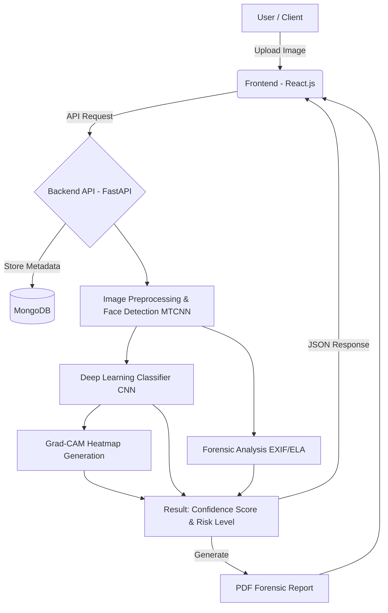

# Week 2 Synopsis

**DeepTrace: Explainable Deepfake and AI-Generated Image Detection System**

## Abstract
This project aims to combat the growing threat of digital misinformation and online fraud by developing a web-based system for detecting deepfakes and AI-generated images. By leveraging advanced deep learning techniques, the system will analyze visual patterns and image metadata to accurately classify images as real or manipulated. The solution includes face detection, error level analysis, metadata extraction, and explainable AI techniques like Grad-CAM to highlight suspicious regions. Developed using Python, FastAPI, React.js, and PyTorch/TensorFlow, DeepTrace will provide users with a confidence score, risk level, and a downloadable forensic report to easily verify image authenticity.

## 1. Introduction
### 1.1 Background and Context
With the rapid advancements in Generative AI, creating hyper-realistic manipulated images (deepfakes) has become easily accessible. This has led to a surge in misinformation, fake identities, and digital fraud, making it increasingly difficult for average users and professionals to distinguish between authentic and manipulated media.

### 1.2 Problem Statement
Deepfake and AI-generated images are being increasingly weaponized for misinformation and online fraud. Currently, there is a lack of accessible and explainable tools for normal users, journalists, and investigators to quickly and reliably verify whether an image is real or manipulated.

### 1.3 Significance of the Project
DeepTrace provides a crucial layer of trust and security in digital media. By offering not just a detection result but also an explainable heatmap and forensic analysis, it empowers users to make informed decisions, thereby reducing the spread of misinformation and digital media fraud.

### 1.4 Objectives
*   Develop a deep learning model to classify images as real, deepfake, or AI-generated.
*   Implement image preprocessing and face detection for targeted analysis.
*   Extract and analyze EXIF/metadata and perform Error Level Analysis (ELA) for forensic checking.
*   Provide explainable heatmaps (e.g., using Grad-CAM) to visualize suspicious regions in images.
*   Create an intuitive web interface with a user dashboard for analysis history and downloadable forensic reports.

### 1.5 Scope and Limitations
**Scope:** Image upload and analysis, real/fake classification, confidence scoring, metadata analysis, visual forensic indicators (heatmaps), and PDF report generation.
**Limitations:** Primarily focused on image files (not video or audio deepfakes initially). Accuracy depends on the diversity and quality of the training dataset.

## 2. Methodology
### 2.1 Technical Approach
The project follows a client-server architecture using a FastAPI backend and a React.js frontend. The AI logic utilizes Convolutional Neural Networks (CNNs) for classification, MTCNN for face detection, and Grad-CAM for model explainability. Traditional forensic techniques like ELA and metadata extraction complement the deep learning approach.

### 2.2 System Architecture

### 2.3 Functional Modules Overview
*   User Registration & Login (JWT Auth)
*   Image Upload & Preprocessing Interface
*   Deep Learning Classification Engine
*   Forensic Analysis Module (EXIF, Error Level Analysis)
*   Explainability Module (Grad-CAM Heatmaps)
*   Dashboard & PDF Report Generator

## 3. UI Wireframes & Mockups

*(Note: Insert simple UI Mockups here as per evaluation requirements. Since the project is not built yet, you can use Figma, Balsamiq, or Canva to design quick low-fidelity screens for the UI.)*

**Figure 1: Proposed Dashboard / Image Upload Screen**
*[Insert Screenshot Here]*

**Figure 2: Analysis Results Screen showing Confidence Score and Heatmap**
*[Insert Screenshot Here]*

## 4. Tools and Technologies
### 4.1 Programming Languages
Python, JavaScript, HTML, CSS

### 4.2 Frameworks / Libraries
FastAPI, React.js, Tailwind CSS, PyTorch (or TensorFlow), OpenCV, PIL, MTCNN, ReportLab / jsPDF

### 4.3 Databases / Storage
MongoDB

### 4.4 IDEs / Platforms
VS Code, Jupyter Notebook, GitHub

### 4.5 APIs / External Integrations
(Optional) Third-party threat intelligence APIs or datasets for model updating.

### 4.6 Hosting / Deployment Tools
Render / Vercel

## 5. Project Plan
### 5.1 Module-wise Feature Breakdown
| Module | Description |
| :--- | :--- |
| Authentication & UI Setup | User registration, login, and frontend skeleton creation. |
| Image Processing Pipeline | Image upload handling, preprocessing, and MTCNN face detection. |
| AI Model Integration | Training/loading the deep learning classification model and prediction logic. |
| Forensic & Explainability | EXIF extraction, ELA implementation, and Grad-CAM heatmap generation. |
| Results & Dashboard | Displaying confidence scores, risk levels, and user analysis history. |
| Report Generation | Generating downloadable PDF reports summarizing the forensic findings. |

### 5.2 Week-wise Development Timeline
| Module | Planned Weeks | Expected Deliverables |
| :--- | :--- | :--- |
| Module 1: UI & Auth | Week 3–4 | Working frontend with login and image upload UI. |
| Module 2: Image Pipeline | Week 4–5 | Backend API for image upload and face detection. |
| Module 3: Model Logic | Week 5–6 | Integration of the deep learning model for prediction. |
| Module 4: Forensics | Week 6–7 | Implementation of EXIF, ELA, and heatmaps. |
| Module 5: Dashboard | Week 7–8 | Integration of history tracking and result visualization. |
| Module 6: Reports & Polish | Week 9–10 | PDF report generation and end-to-end testing. |
| Final Documentation | Week 11 | Final formatted report. |
| Final Demo & Eval | Week 12 | Presentation and submission. |

### 5.3 Expected Outcomes
*   A fully functional web-based image authenticity verification tool.
*   High-accuracy classification for deepfakes and AI-generated images.
*   Clear visual explanations (heatmaps) for the model's decisions.
*   Detailed forensic PDF reports for users.

### 5.4 Risk Factors / Assumptions
*   **Risk:** Evolving deepfake generation techniques may bypass current detection models.
*   **Assumption:** Sufficient labeled data (real vs. fake) is available for effective model training or fine-tuning.
*   **Risk:** High computational cost for running deep learning models in real-time.

## 6. Literature Survey
| S. No. | Source Title / Tool | Key Idea | Project Relevance |
| :--- | :--- | :--- | :--- |
| 1 | "Deepfake Video Detection using Recurrent Neural Networks" - IEEE | Highlights temporal and spatial inconsistencies in deepfakes. | Provides foundational knowledge on CNNs for spatial artifact detection in images. |
| 2 | "Face X-ray for More General Face Forgery Detection" - CVPR (2020) | Detects blending boundaries in manipulated images. | Inspires the use of visual forensic indicators beyond just binary classification. |
| 3 | MTCNN (Multi-task Cascaded Convolutional Networks) | State-of-the-art framework for face detection and alignment. | Core component for preprocessing images to focus on facial manipulations. |
| 4 | Grad-CAM (Gradient-weighted Class Activation Mapping) | Visual explanations from deep networks. | Crucial for the explainability aspect (heatmaps) of DeepTrace. |
| 5 | "Error Level Analysis (ELA)" techniques | Analyzes compression levels to find modified regions in JPEGs. | Supports the traditional forensic analysis module of the project. |

## References (APA Style)
1.  Güera, D., & Delp, E. J. (2018). Deepfake video detection using recurrent neural networks. *2018 15th IEEE International Conference on Advanced Video and Signal Based Surveillance (AVSS)*, 1-6.
2.  Li, L., Bao, J., Zhang, T., Yang, H., Chen, D., Wen, F., & Guo, B. (2020). Face X-ray for more general face forgery detection. *Proceedings of the IEEE/CVF Conference on Computer Vision and Pattern Recognition*, 5001-5010.
3.  Zhang, K., Zhang, Z., Li, Z., & Qiao, Y. (2016). Joint face detection and alignment using multitask cascaded convolutional networks. *IEEE Signal Processing Letters*, 23(10), 1499-1503.
4.  Selvaraju, R. R., Cogswell, M., Das, A., Vedantam, R., Parikh, D., & Batra, D. (2017). Grad-cam: Visual explanations from deep networks via gradient-based localization. *Proceedings of the IEEE international conference on computer vision*, 618-626.
5.  Krawtz, N. (2007). A picture's worth: Digital image analysis and forensics. *Hacker Factor Solutions*.
