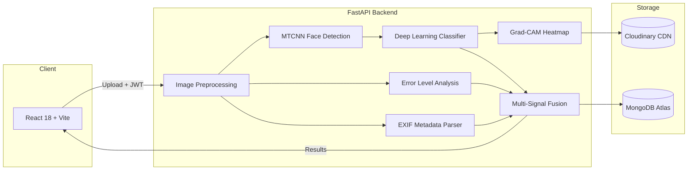
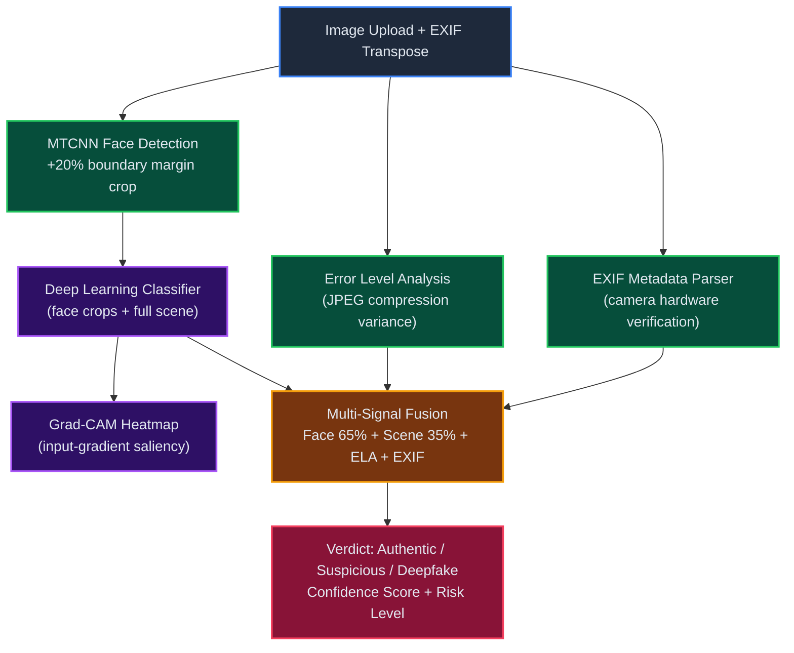

# DeepTrace

**Explainable Deepfake & AI-Generated Image Detection System**

An open-source forensic platform that detects manipulated faces and synthetic images using deep learning, with full visual explainability through Grad-CAM heatmaps, Error Level Analysis, and EXIF metadata verification.

---

## Architecture



## How It Works

| Step | Module | Description |
|------|--------|-------------|
| 1 | **Face Detection** | MTCNN isolates facial regions with 20% contextual boundary padding |
| 2 | **Classification** | Deep learning model classifies face crops as Real or Fake |
| 3 | **Error Level Analysis** | JPEG re-compression variance reveals localized cut-and-paste edits |
| 4 | **EXIF Verification** | Camera hardware metadata validates image provenance |
| 5 | **Signal Fusion** | Weighted ensemble (65% face AI + 35% scene + ELA + EXIF) produces final verdict |
| 6 | **Explainability** | Grad-CAM heatmap highlights which pixels drove the decision |
| 7 | **Forensic Report** | Automated multi-page PDF dossier with all evidence |

## Tech Stack

| Layer | Technology |
|-------|------------|
| Frontend | React 18, Vite 5, Tailwind CSS, Framer Motion |
| Backend | FastAPI, Uvicorn |
| ML & Vision | PyTorch, HuggingFace Transformers, MTCNN, OpenCV |
| Explainability | Grad-CAM (input-gradient saliency) |
| Forensics | Error Level Analysis, EXIF metadata parsing |
| Database | MongoDB Atlas |
| Media Storage | Cloudinary CDN |
| Auth | JWT (HMAC-SHA256) + bcrypt |
| Reports | ReportLab PDF engine |

## Project Structure

```
DeepTrace/
├── backend/
│   ├── main.py              # FastAPI server & API routes
│   ├── analyzer.py          # ML analysis pipeline
│   ├── report.py            # PDF forensic report generator
│   ├── database.py          # MongoDB Atlas integration
│   ├── auth.py              # JWT authentication
│   ├── cloud.py             # Cloudinary media uploads
│   ├── requirements.txt     # Python dependencies
│   ├── tests/               # Test suites
│   │   └── test_e2e.py      # End-to-end integration tests
│   ├── models/              # Trained model weights
│   └── scripts/             # Training notebooks & documentation
│
├── frontend/
│   ├── src/
│   │   ├── App.jsx          # Root component
│   │   └── components/      # Landing, Login, Dashboard, Results,
│   │                        # History, Settings, ReportPreview
│   ├── vite.config.js       # Dev server + API proxy
│   ├── tailwind.config.js   # Theme configuration
│   └── package.json
│
└── README.md
```

## Quick Start

### Prerequisites

- Python 3.10+
- Node.js 18+
- MongoDB Atlas account ([free tier](https://www.mongodb.com/cloud/atlas))
- Cloudinary account ([free tier](https://cloudinary.com/))

### 1. Backend

```bash
cd backend
python -m venv venv
source venv/bin/activate        # Windows: venv\Scripts\activate
pip install -r requirements.txt
```

Create a `.env` file:

```env
MONGODB_URI=mongodb+srv://<user>:<pass>@<cluster>.mongodb.net/
JWT_SECRET=your-secret-key
CLOUDINARY_URL=cloudinary://<key>:<secret>@<cloud>
DEEPTRACE_MODEL=dima806/deepfake_vs_real_image_detection
```

Start the server:

```bash
python main.py
```

The API starts at `http://localhost:8000`. The classification model downloads automatically on first run (~200MB).

### 2. Frontend

```bash
cd frontend
npm install
npm run dev
```

Opens at `http://localhost:5173`. API calls are proxied to the backend automatically.

### 3. Use

1. Open `http://localhost:5173`
2. Register a new account or log in
3. Upload an image on the Dashboard
4. View analysis results — verdict, confidence, heatmap, ELA, face detection, EXIF data
5. Download a PDF forensic report

## API Reference

| Method | Endpoint | Auth | Description |
|--------|----------|------|-------------|
| `GET` | `/api/health` | — | Server health check |
| `POST` | `/api/auth/register` | — | Register new user |
| `POST` | `/api/auth/login` | — | Authenticate, returns JWT |
| `GET` | `/api/auth/me` | Bearer | Current user profile |
| `POST` | `/api/analyze` | Bearer | Upload image for analysis |
| `GET` | `/api/history` | Bearer | User's analysis history |
| `GET` | `/api/report/{id}` | — | Generate PDF report |
| `GET` | `/api/outputs/{file}` | — | Serve generated images |

## Analysis Pipeline



## Model Training

> The current training pipeline is being redesigned. See [`backend/scripts/README.md`](backend/scripts/README.md) for documentation on past training attempts and the technical rationale for the architectural pivot from Swin Transformer to EfficientNet-B4.

**Current state:** Using a pre-trained HuggingFace model for inference. Custom EfficientNet-B4 training on FaceForensics++ is in progress.

**Model configuration** is controlled via the `DEEPTRACE_MODEL` environment variable — supports both HuggingFace model IDs and local paths:

```env
# HuggingFace model (downloads automatically)
DEEPTRACE_MODEL=dima806/deepfake_vs_real_image_detection

# Local fine-tuned model
DEEPTRACE_MODEL=./models/deeptrace-efficientnet
```

## License

This project is developed as part of an academic capstone project.

---

<div align="center">
  <strong>DeepTrace</strong> — Forensic AI for the Misinformation Age
</div>
